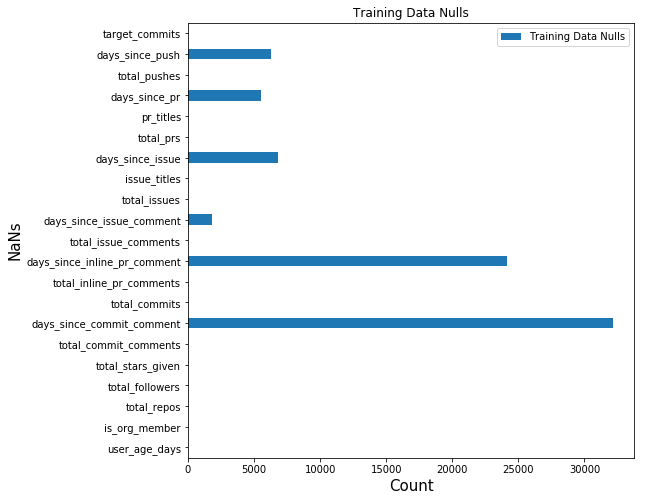
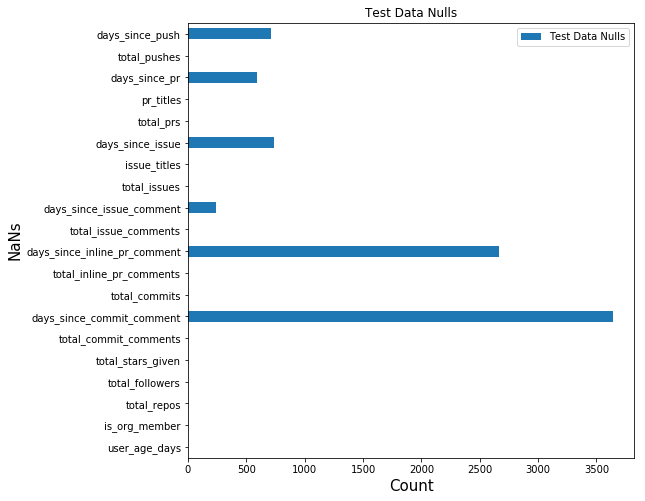
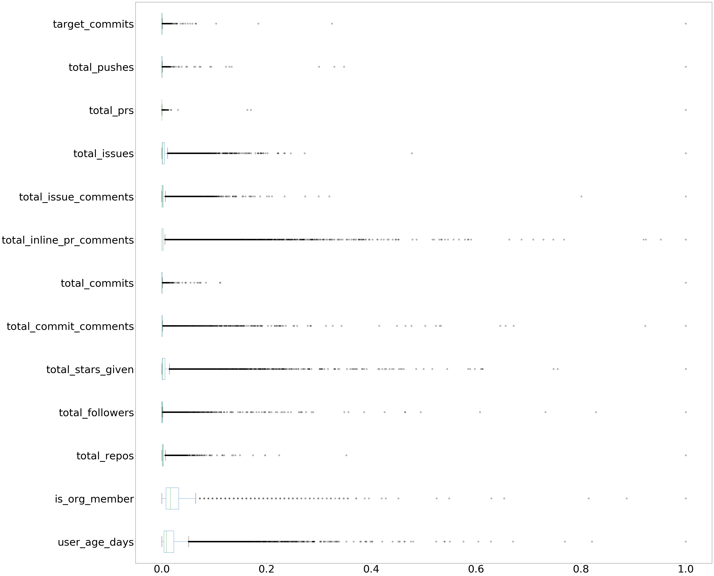
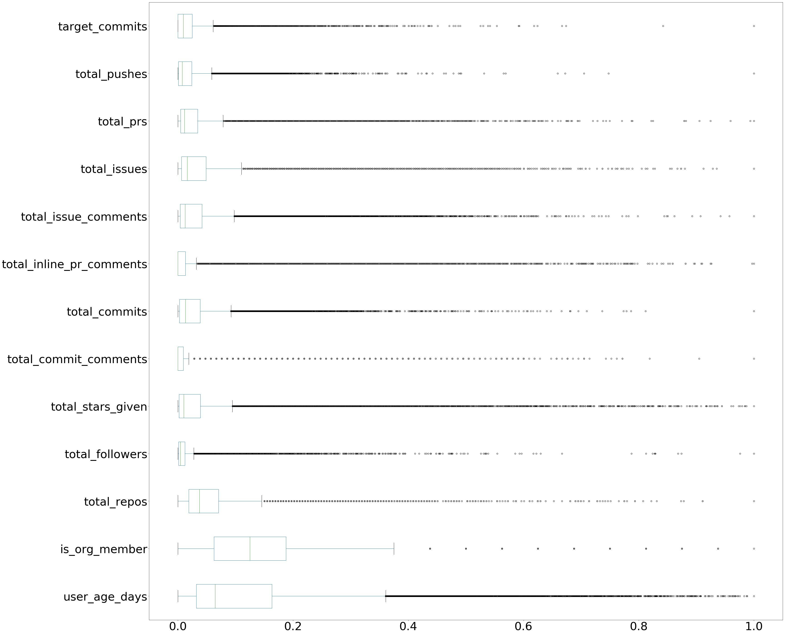
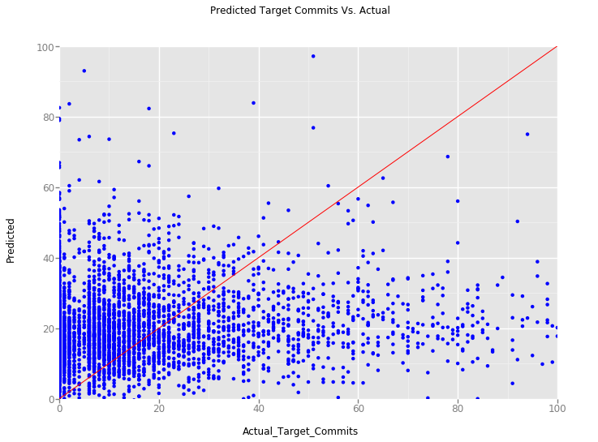
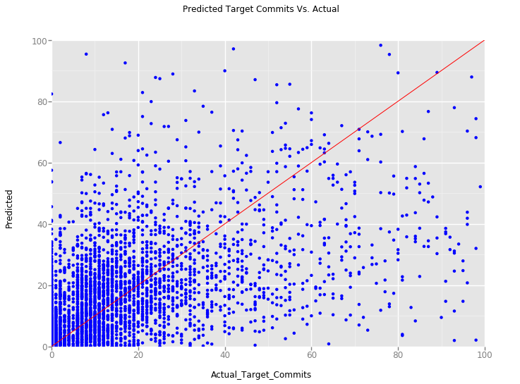

+++
showonlyimage = false
draft = false 
image = "/github_analysis_files/github_avatar.png"
date = "2007-10-04T00:00:00Z"
description="An analysis for Slack"
title = "Slack Analysis"
weight = 0
author = "David Karapetyan"
tags = [ "data_science" ]
+++

# Introduction

We will split our analysis into a series of steps, which will be
identifiable via header titles. We begin by 
importing all the modules we will need in our analysis. 


```python
from itertools import izip_longest, chain
import heapq
import scipy.stats
import numpy as np
from sklearn.decomposition import PCA
from sklearn.metrics import mean_squared_error
from sklearn.feature_selection import VarianceThreshold
from sklearn.feature_extraction.text import TfidfVectorizer
from sklearn.pipeline import FeatureUnion, Pipeline
from sklearn.model_selection import cross_val_predict, KFold
from sklearn.ensemble import IsolationForest
from sklearn.linear_model import LinearRegression
from sklearn.ensemble import RandomForestRegressor
from sklearn.preprocessing import MinMaxScaler
from sklearn.feature_extraction.stop_words import ENGLISH_STOP_WORDS
from sklearn.base import BaseEstimator, TransformerMixin
from sklearn.covariance import EllipticEnvelope
from ggplot import *
import pandas as pd
from IPython.display import display
import matplotlib.pyplot as plt
import matplotlib

matplotlib.interactive(True)
SAMPLE_FRAC = 0.1
RANDOM_STATE = 1
CONTAMINATION = 0.1
```

# Data Overview


Next, we identify the number of categorical and continuous variables,
as this will effect how we preprocess the data before we input it into a
predictive model. We will ignore the huid data, as this is merely a
user signifier, and has no relation to the actual user. Hence,
it will have no predictive power, and so we can drop it. Also,
we will do our preprocessing with the target_commits (the variable we wish
to predict) appended to our feature space. This is for ease of coding,
and computation.

First, we isolate the continuous and categorical features, and get a general
overview of our data. Note that the huid is merely a user signifier, and has
no relation to the actual user.
Hence, it will have no predictive power, and we can drop it.


```python
# read data
train_data_orig = pd.read_csv("data/train_data.tsv", delimiter='\t')
test_data_orig = pd.read_csv("data/test_data.tsv", delimiter='\t')

# drop huid
train_data = train_data_orig.drop('huid', axis=1)
test_data = test_data_orig.drop('huid', axis=1)

# identify types of features
text_feats = train_data.columns[train_data.dtypes == 'object']
continuous_feats_old = train_data.columns[train_data.dtypes != 'object']
```

An inspection of this data indicates that, with the exception of the huid, we
only have continuous data, and
textual data, which as we shall see, can also be mapped to a continuum of
values.
That is, after dropping the huid, there will be no categorial data here (Of
note  is that we treat 'is_org_member' as a continuous variable, since it
represents the lower bound for the number or organizations. It may seem
n-ary, but it is not).


Now that we have classified our features, 
we next get an overview of nulls in our data.


```python
def na_plotter(data=None, title=None):
    bar_data = data.isnull().sum().to_frame(name=title)
    display(bar_data.transpose())
    fig = bar_data.plot.barh(figsize=(8, 8))
    plt.xlabel('Count', fontsize=15)
    plt.ylabel('NaNs', fontsize=15)
    plt.title(title)
    return fig


tr_null_fig = na_plotter(train_data, 'Training Data Nulls')
plt.show()
te_null_fig = na_plotter(test_data, 'Test Data Nulls')
plt.show()
```


<div>
<table border="1" class="dataframe">
  <thead>
    <tr style="text-align: right;">
      <th></th>
      <th>user_age_days</th>
      <th>is_org_member</th>
      <th>total_repos</th>
      <th>total_followers</th>
      <th>total_stars_given</th>
      <th>total_commit_comments</th>
      <th>days_since_commit_comment</th>
      <th>total_commits</th>
      <th>total_inline_pr_comments</th>
      <th>days_since_inline_pr_comment</th>
      <th>...</th>
      <th>days_since_issue_comment</th>
      <th>total_issues</th>
      <th>issue_titles</th>
      <th>days_since_issue</th>
      <th>total_prs</th>
      <th>pr_titles</th>
      <th>days_since_pr</th>
      <th>total_pushes</th>
      <th>days_since_push</th>
      <th>target_commits</th>
    </tr>
  </thead>
  <tbody>
    <tr>
      <th>Training Data Nulls</th>
      <td>0</td>
      <td>0</td>
      <td>0</td>
      <td>0</td>
      <td>0</td>
      <td>0</td>
      <td>32169</td>
      <td>0</td>
      <td>0</td>
      <td>24129</td>
      <td>...</td>
      <td>1788</td>
      <td>0</td>
      <td>0</td>
      <td>6843</td>
      <td>0</td>
      <td>0</td>
      <td>5526</td>
      <td>0</td>
      <td>6313</td>
      <td>0</td>
    </tr>
  </tbody>
</table>
<p>1 rows × 21 columns</p>
</div>





<div>
<table border="1" class="dataframe">
  <thead>
    <tr style="text-align: right;">
      <th></th>
      <th>user_age_days</th>
      <th>is_org_member</th>
      <th>total_repos</th>
      <th>total_followers</th>
      <th>total_stars_given</th>
      <th>total_commit_comments</th>
      <th>days_since_commit_comment</th>
      <th>total_commits</th>
      <th>total_inline_pr_comments</th>
      <th>days_since_inline_pr_comment</th>
      <th>total_issue_comments</th>
      <th>days_since_issue_comment</th>
      <th>total_issues</th>
      <th>issue_titles</th>
      <th>days_since_issue</th>
      <th>total_prs</th>
      <th>pr_titles</th>
      <th>days_since_pr</th>
      <th>total_pushes</th>
      <th>days_since_push</th>
    </tr>
  </thead>
  <tbody>
    <tr>
      <th>Test Data Nulls</th>
      <td>0</td>
      <td>0</td>
      <td>0</td>
      <td>0</td>
      <td>0</td>
      <td>0</td>
      <td>3643</td>
      <td>0</td>
      <td>0</td>
      <td>2668</td>
      <td>0</td>
      <td>237</td>
      <td>0</td>
      <td>0</td>
      <td>738</td>
      <td>0</td>
      <td>0</td>
      <td>589</td>
      <td>0</td>
      <td>708</td>
    </tr>
  </tbody>
</table>
</div>





# Data Munging

Since our goal in this exercise is to evaluate against a test set, and
obtain output _for all huids_ in that test set, we must eliminate nulls
by **dropping features and not samples**.

Note: Filling the NaNs is in itself a prediction problem: in
order to
fill  NaN for one huid, we need to know its relationship to the other huids
that do not have nulls. This in itself is a prediction problem. Hence,
given time limitations for this exercise, it makes more sense to
drop the NAs, rather than fill.


```python
# drop features with nulls column
cols_to_drop = train_data.columns[train_data.isnull().sum() > 0]
train_data_drop_col = train_data.drop(cols_to_drop, axis=1)
test_data_drop_col = test_data.drop(cols_to_drop, axis=1)
non_text_feats = [col for col in train_data_drop_col.columns if
                  col in continuous_feats_old]

# display
train_data_drop_col.describe()
```


<div>
<table border="1" class="dataframe">
  <thead>
    <tr style="text-align: right;">
      <th></th>
      <th>user_age_days</th>
      <th>is_org_member</th>
      <th>total_repos</th>
      <th>total_followers</th>
      <th>total_stars_given</th>
      <th>total_commit_comments</th>
      <th>total_commits</th>
      <th>total_inline_pr_comments</th>
      <th>total_issue_comments</th>
      <th>total_issues</th>
      <th>total_prs</th>
      <th>total_pushes</th>
      <th>target_commits</th>
    </tr>
  </thead>
  <tbody>
    <tr>
      <th>count</th>
      <td>50000.000000</td>
      <td>50000.000000</td>
      <td>50000.000000</td>
      <td>50000.000000</td>
      <td>50000.000000</td>
      <td>50000.00000</td>
      <td>50000.000000</td>
      <td>50000.000000</td>
      <td>50000.000000</td>
      <td>50000.000000</td>
      <td>50000.000000</td>
      <td>50000.000000</td>
      <td>50000.000000</td>
    </tr>
    <tr>
      <th>mean</th>
      <td>5813.135860</td>
      <td>2.825700</td>
      <td>16.541420</td>
      <td>47.352540</td>
      <td>106.088360</td>
      <td>3.31368</td>
      <td>316.511180</td>
      <td>42.065280</td>
      <td>151.985820</td>
      <td>20.167980</td>
      <td>36.553500</td>
      <td>284.865900</td>
      <td>25.676840</td>
    </tr>
    <tr>
      <th>std</th>
      <td>8630.662233</td>
      <td>3.651989</td>
      <td>37.012601</td>
      <td>345.532015</td>
      <td>319.739966</td>
      <td>18.23674</td>
      <td>3707.591458</td>
      <td>166.376516</td>
      <td>467.072237</td>
      <td>48.157965</td>
      <td>868.074846</td>
      <td>4236.626801</td>
      <td>316.804479</td>
    </tr>
    <tr>
      <th>min</th>
      <td>365.000000</td>
      <td>0.000000</td>
      <td>1.000000</td>
      <td>0.000000</td>
      <td>0.000000</td>
      <td>0.00000</td>
      <td>0.000000</td>
      <td>0.000000</td>
      <td>0.000000</td>
      <td>0.000000</td>
      <td>0.000000</td>
      <td>0.000000</td>
      <td>0.000000</td>
    </tr>
    <tr>
      <th>25%</th>
      <td>1458.000000</td>
      <td>1.000000</td>
      <td>5.000000</td>
      <td>2.000000</td>
      <td>4.000000</td>
      <td>0.00000</td>
      <td>22.000000</td>
      <td>0.000000</td>
      <td>9.000000</td>
      <td>2.000000</td>
      <td>3.000000</td>
      <td>11.000000</td>
      <td>0.000000</td>
    </tr>
    <tr>
      <th>50%</th>
      <td>2745.000000</td>
      <td>2.000000</td>
      <td>10.000000</td>
      <td>8.000000</td>
      <td>19.000000</td>
      <td>0.00000</td>
      <td>109.000000</td>
      <td>1.000000</td>
      <td>30.000000</td>
      <td>6.000000</td>
      <td>8.000000</td>
      <td>76.000000</td>
      <td>9.000000</td>
    </tr>
    <tr>
      <th>75%</th>
      <td>6729.750000</td>
      <td>4.000000</td>
      <td>18.000000</td>
      <td>26.000000</td>
      <td>81.000000</td>
      <td>1.00000</td>
      <td>329.000000</td>
      <td>14.000000</td>
      <td>119.000000</td>
      <td>19.000000</td>
      <td>27.000000</td>
      <td>255.000000</td>
      <td>25.000000</td>
    </tr>
    <tr>
      <th>max</th>
      <td>279124.000000</td>
      <td>124.000000</td>
      <td>5485.000000</td>
      <td>30038.000000</td>
      <td>13569.000000</td>
      <td>1239.00000</td>
      <td>792665.000000</td>
      <td>5602.000000</td>
      <td>43325.000000</td>
      <td>3923.000000</td>
      <td>188194.000000</td>
      <td>790770.000000</td>
      <td>64538.000000</td>
    </tr>
  </tbody>
</table>
</div>


## Identifying Collinearity in Non-Textual Variables

Many of the non-textual variables should, intuitively, be correlated: for
example, 'total_stars_given' and 'total_commit_comments'. To confirm this,
we use a PCA and examine the explained variance of the components.


```python
# setup PCA so it identifies the dimensionality
pca = PCA(random_state=RANDOM_STATE)
pca_fit = pca.fit(train_data_drop_col[non_text_feats[:-1]])
print({"Explained Variance Ratio": pca_fit.explained_variance_ratio_})
```

    {'Explained Variance Ratio': array([  6.94804924e-01,   2.72357926e-01,   2.17991968e-02,
             6.95808983e-03,   1.98187673e-03,   1.03073412e-03,
             8.63584292e-04,   1.77038588e-04,   1.79374166e-05,
             5.86099604e-06,   2.81604665e-06,   1.51831640e-08])}


Note that the first two components explain almost 98% of the variance.
It is clear that the dimensionality of the non-textual variables is really
two.

Note: we will use this later when fitting our model to provide additional
perspective on the feature importances the model implies.

## Outlier Detection


```python
# display overview of features
display(train_data[text_feats].head(20))
display(train_data[non_text_feats].head(20))


#
# Glancing at the above, it seems our data has a number of
# outliers. To see this, observe the
# large relative discrepancy (i.e. + 3 std) between the 2nd quartile
# in some of our features, and the maximum value in that feature.
# Furthermore, some feature max values, such as total_commits, are clearly
# bad data (792665 commits a year comes out to an average of 2177 a day).

# To corroborate, we scale the data in each feature between 0
# and 1, and use boxplots to gain an idea of the distribution of the
# data--and to visually see the outliers.
```


<div>
<table border="1" class="dataframe">
  <thead>
    <tr style="text-align: right;">
      <th></th>
      <th>issue_titles</th>
      <th>pr_titles</th>
    </tr>
  </thead>
  <tbody>
    <tr>
      <th>0</th>
      <td>[Change how documentation is built, New Change...</td>
      <td>[Don't create welcome pages without webroots, ...</td>
    </tr>
    <tr>
      <th>1</th>
      <td>[PHP Warning when converting]</td>
      <td>[Profile api, Fix Phone Number Order, Email te...</td>
    </tr>
    <tr>
      <th>2</th>
      <td>[Web connectivity test contains null in blocki...</td>
      <td>[Ui/redesigned, Result view, App v0.1.0 , Info...</td>
    </tr>
    <tr>
      <th>3</th>
      <td>[Profile CeCity, Add D3.js To The Toolbox, Sea...</td>
      <td>[Fixing The Dead Link]</td>
    </tr>
    <tr>
      <th>4</th>
      <td>[Nightscout test fails if url ends with /, His...</td>
      <td>[make the same, replaced references to old daw...</td>
    </tr>
    <tr>
      <th>5</th>
      <td>[Prevent nodes with duplicate names being regi...</td>
      <td>[Enable barman-wal-restore.py to pass -c/--con...</td>
    </tr>
    <tr>
      <th>6</th>
      <td>[Allow DNS domain on API request, Specify DNS ...</td>
      <td>[Fix comment typo on CarrierCore, Applied fixe...</td>
    </tr>
    <tr>
      <th>7</th>
      <td>[Wrong Projected Point, 32bit build fails, Loc...</td>
      <td>[Kk lesslua, trusty updates, pass args to inst...</td>
    </tr>
    <tr>
      <th>8</th>
      <td>[refactor code and released a new version, Per...</td>
      <td>[Support for AWS Elasticache Autodiscovery, Bu...</td>
    </tr>
    <tr>
      <th>9</th>
      <td>[Community suggestion: email should sequence t...</td>
      <td>[Fix link to Docker's user guide, Release 0.9....</td>
    </tr>
    <tr>
      <th>10</th>
      <td>[Use a SUID/sudo-approved shim to create names...</td>
      <td>[Note in the readme that this is in linux 3.17]</td>
    </tr>
    <tr>
      <th>11</th>
      <td>[Allow referencing from ERB templates other fi...</td>
      <td>[Document how to enable SSI, Do not delaycompr...</td>
    </tr>
    <tr>
      <th>12</th>
      <td>[Remove CommonContext, Icons on buttons, More ...</td>
      <td>[Add support for Gnome 3.20, Implement list me...</td>
    </tr>
    <tr>
      <th>13</th>
      <td>[Leaf Monocle, Switching to the Most Recent Ta...</td>
      <td>[]</td>
    </tr>
    <tr>
      <th>14</th>
      <td>[Are updates thread-safe?, Running jpylyzer on...</td>
      <td>[Added an initial Dockerfile that can build an...</td>
    </tr>
    <tr>
      <th>15</th>
      <td>[Fastboot, Silent fail when network is big, Ad...</td>
      <td>[Temporary loggin on cluster node, Slurm defau...</td>
    </tr>
    <tr>
      <th>16</th>
      <td>[Control defaults per html demo pages, Add API...</td>
      <td>[A couple of additions to Hanbyuls lrm branch,...</td>
    </tr>
    <tr>
      <th>17</th>
      <td>[Resolve missing $error_occurred var, New "rep...</td>
      <td>[Fix typo and sync readme content with config ...</td>
    </tr>
    <tr>
      <th>18</th>
      <td>[Support blackfire on PHP 7, Middle-click on a...</td>
      <td>[Fix the handling of preincrement and predecre...</td>
    </tr>
    <tr>
      <th>19</th>
      <td>[Footnotes Extension?, activeElement can be nu...</td>
      <td>[Add observe method to Kefir.Observable, Assig...</td>
    </tr>
  </tbody>
</table>
</div>


<div>
<table border="1" class="dataframe">
  <thead>
    <tr style="text-align: right;">
      <th></th>
      <th>user_age_days</th>
      <th>is_org_member</th>
      <th>total_repos</th>
      <th>total_followers</th>
      <th>total_stars_given</th>
      <th>total_commit_comments</th>
      <th>total_commits</th>
      <th>total_inline_pr_comments</th>
      <th>total_issue_comments</th>
      <th>total_issues</th>
      <th>total_prs</th>
      <th>total_pushes</th>
      <th>target_commits</th>
    </tr>
  </thead>
  <tbody>
    <tr>
      <th>0</th>
      <td>7744</td>
      <td>4</td>
      <td>104</td>
      <td>151</td>
      <td>189</td>
      <td>8</td>
      <td>2003</td>
      <td>190</td>
      <td>969</td>
      <td>13</td>
      <td>489</td>
      <td>985</td>
      <td>55</td>
    </tr>
    <tr>
      <th>1</th>
      <td>959</td>
      <td>1</td>
      <td>7</td>
      <td>0</td>
      <td>4</td>
      <td>0</td>
      <td>711</td>
      <td>31</td>
      <td>78</td>
      <td>1</td>
      <td>61</td>
      <td>549</td>
      <td>15</td>
    </tr>
    <tr>
      <th>2</th>
      <td>6920</td>
      <td>4</td>
      <td>11</td>
      <td>6</td>
      <td>3</td>
      <td>0</td>
      <td>80</td>
      <td>43</td>
      <td>54</td>
      <td>14</td>
      <td>12</td>
      <td>149</td>
      <td>65</td>
    </tr>
    <tr>
      <th>3</th>
      <td>160776</td>
      <td>56</td>
      <td>118</td>
      <td>307</td>
      <td>152</td>
      <td>2</td>
      <td>66571</td>
      <td>0</td>
      <td>29</td>
      <td>3</td>
      <td>1</td>
      <td>73006</td>
      <td>1308</td>
    </tr>
    <tr>
      <th>4</th>
      <td>2024</td>
      <td>0</td>
      <td>19</td>
      <td>5</td>
      <td>51</td>
      <td>0</td>
      <td>821</td>
      <td>5</td>
      <td>17</td>
      <td>5</td>
      <td>24</td>
      <td>763</td>
      <td>85</td>
    </tr>
    <tr>
      <th>5</th>
      <td>1311</td>
      <td>1</td>
      <td>6</td>
      <td>9</td>
      <td>16</td>
      <td>0</td>
      <td>346</td>
      <td>0</td>
      <td>124</td>
      <td>14</td>
      <td>2</td>
      <td>404</td>
      <td>9</td>
    </tr>
    <tr>
      <th>6</th>
      <td>8515</td>
      <td>5</td>
      <td>164</td>
      <td>71</td>
      <td>450</td>
      <td>34</td>
      <td>677</td>
      <td>873</td>
      <td>2218</td>
      <td>186</td>
      <td>340</td>
      <td>1994</td>
      <td>38</td>
    </tr>
    <tr>
      <th>7</th>
      <td>6309</td>
      <td>3</td>
      <td>21</td>
      <td>13</td>
      <td>5</td>
      <td>13</td>
      <td>1044</td>
      <td>259</td>
      <td>433</td>
      <td>60</td>
      <td>222</td>
      <td>1609</td>
      <td>17</td>
    </tr>
    <tr>
      <th>8</th>
      <td>6236</td>
      <td>2</td>
      <td>23</td>
      <td>1028</td>
      <td>720</td>
      <td>0</td>
      <td>231</td>
      <td>20</td>
      <td>120</td>
      <td>4</td>
      <td>24</td>
      <td>192</td>
      <td>16</td>
    </tr>
    <tr>
      <th>9</th>
      <td>4280</td>
      <td>4</td>
      <td>10</td>
      <td>38</td>
      <td>6</td>
      <td>1</td>
      <td>861</td>
      <td>435</td>
      <td>1539</td>
      <td>175</td>
      <td>211</td>
      <td>962</td>
      <td>37</td>
    </tr>
    <tr>
      <th>10</th>
      <td>2771</td>
      <td>1</td>
      <td>9</td>
      <td>4</td>
      <td>12</td>
      <td>0</td>
      <td>2</td>
      <td>0</td>
      <td>14</td>
      <td>5</td>
      <td>1</td>
      <td>0</td>
      <td>28</td>
    </tr>
    <tr>
      <th>11</th>
      <td>4586</td>
      <td>2</td>
      <td>28</td>
      <td>17</td>
      <td>86</td>
      <td>0</td>
      <td>6</td>
      <td>1</td>
      <td>64</td>
      <td>27</td>
      <td>9</td>
      <td>1</td>
      <td>0</td>
    </tr>
    <tr>
      <th>12</th>
      <td>8825</td>
      <td>5</td>
      <td>27</td>
      <td>27</td>
      <td>89</td>
      <td>0</td>
      <td>481</td>
      <td>10</td>
      <td>140</td>
      <td>67</td>
      <td>12</td>
      <td>396</td>
      <td>9</td>
    </tr>
    <tr>
      <th>13</th>
      <td>4436</td>
      <td>2</td>
      <td>17</td>
      <td>71</td>
      <td>1625</td>
      <td>1</td>
      <td>306</td>
      <td>0</td>
      <td>25</td>
      <td>7</td>
      <td>0</td>
      <td>226</td>
      <td>14</td>
    </tr>
    <tr>
      <th>14</th>
      <td>22224</td>
      <td>8</td>
      <td>40</td>
      <td>59</td>
      <td>67</td>
      <td>6</td>
      <td>3127</td>
      <td>6</td>
      <td>181</td>
      <td>72</td>
      <td>15</td>
      <td>2603</td>
      <td>227</td>
    </tr>
    <tr>
      <th>15</th>
      <td>4696</td>
      <td>2</td>
      <td>9</td>
      <td>4</td>
      <td>36</td>
      <td>0</td>
      <td>202</td>
      <td>0</td>
      <td>22</td>
      <td>12</td>
      <td>8</td>
      <td>1</td>
      <td>41</td>
    </tr>
    <tr>
      <th>16</th>
      <td>1776</td>
      <td>3</td>
      <td>16</td>
      <td>3</td>
      <td>4</td>
      <td>0</td>
      <td>688</td>
      <td>15</td>
      <td>58</td>
      <td>8</td>
      <td>123</td>
      <td>699</td>
      <td>32</td>
    </tr>
    <tr>
      <th>17</th>
      <td>2296</td>
      <td>1</td>
      <td>26</td>
      <td>20</td>
      <td>175</td>
      <td>5</td>
      <td>421</td>
      <td>131</td>
      <td>638</td>
      <td>15</td>
      <td>252</td>
      <td>460</td>
      <td>11</td>
    </tr>
    <tr>
      <th>18</th>
      <td>27228</td>
      <td>12</td>
      <td>261</td>
      <td>1241</td>
      <td>188</td>
      <td>69</td>
      <td>336</td>
      <td>2112</td>
      <td>3438</td>
      <td>110</td>
      <td>133</td>
      <td>172</td>
      <td>33</td>
    </tr>
    <tr>
      <th>19</th>
      <td>7998</td>
      <td>6</td>
      <td>50</td>
      <td>44</td>
      <td>33</td>
      <td>2</td>
      <td>614</td>
      <td>30</td>
      <td>273</td>
      <td>40</td>
      <td>35</td>
      <td>345</td>
      <td>44</td>
    </tr>
  </tbody>
</table>
</div>


```python
def plot_outliers(feat_df):
    data_for_plot = MinMaxScaler(feature_range=(0, 1), copy=True).fit_transform(
        feat_df)
    df_for_plot = pd.DataFrame(data=data_for_plot, columns=feat_df.columns)
    fig = df_for_plot.plot(kind='box', figsize=(50, 50), fontsize=50,
                           vert=False)
    return fig


out_fig = plot_outliers(train_data_drop_col[non_text_feats])
plt.show()
```





To reduce the presence of the outliers, we test both an
Isolation Forest and an
Elliptic Envelope on our dataset. The boxplots suggest that
assuming that at least 10% of the samples have outliers in one or more than
one feature is a reasonable starting point (the density of outlier points in
many feature colums remains high for a distance of 0.1 units).
Note that we may opt later on to
abandon filtering of outliers if our model has predictive power without it,
as outlier filtering has the risk of introducing bias into
our model, which in turn could increase the RMSE of our model against a test
set. However, for now, we include outlier filtering, as the presence of
a few extreme outliers that are due to noise and are somehow not 'true' data
may skew our model towards fitting the noise a bit better, at the expense
of the non-extreme points closer to the center of the data, and so increase
the variance of the model and, potentially, the RMSE.


```python
def outlier_filter_ee(feat_df, feats_to_consider):
    env = EllipticEnvelope(contamination=CONTAMINATION)
    df_to_fit = feat_df[feats_to_consider]
    fitted = env.fit(df_to_fit)
    results = fitted.predict(df_to_fit)
    results_bool = pd.Series(results).apply(bool).values
    fin = feat_df[results_bool]
    return fin


def outlier_filter_if(feat_df, feats_to_consider):
    iso_forest = IsolationForest(max_samples=1.0,
                                 max_features=len(feats_to_consider),
                                 contamination=CONTAMINATION, n_estimators=1000)
    iso_forest.fit(X=feat_df[feats_to_consider])
    bool_ints = iso_forest.predict(feat_df[feats_to_consider])
    bools = [True if item == 1 else False for item in bool_ints]
    feat_df_filt = feat_df[bools]
    return feat_df_filt


out_fig_ee = plot_outliers(
    outlier_filter_ee(train_data_drop_col,
                      non_text_feats)[non_text_feats])
out_fig_if = plot_outliers(outlier_filter_if(
    train_data_drop_col,
    non_text_feats)[non_text_feats])
plt.show()
```





Comparing these two boxplots with our original outlier boxplot shows that
the Isolation Forest is doing a better job of filtering outliers (the
outlier density in the features after the Isolation Forest is applied is
generally less than the outlier density after the Elliptic Envelope is
applied).

Hence, we opt for using the Isolation Forest on this dataset.

# Feature Extraction, and the Model Pipeline Strategy

We now seek to convert this textual data into numerical data that
preserves the semantic relationship
of works in each issue_title and pr_title. A TfidfVectorizer is an
appropriate approach.

We make sure to drop certain english words in our model (the
ENGLISH_STOP_WORDS) that will have very low tf-idf and
would prove to needlessly increase the time it takes to run our model if
we left them in.

Then, we combine our newly generated text features with our continuous
features. This is in general non-trivial (the text features and continuous
feature data will not have the same shape, for one), however scikit-learn
provides the FeatureUnion to simplify this task.

Lastly, we run our union of features through a model. Since our data
is continuous, a LinearRegression is chosen, due to its high
interpretability, and due to the unavailability of
of Negative Binomial Regressors in scikit-learn, which are often
used for data with dependent variables
consisting of count data.

However, this may well not be an impediment:
if the fit of the Linear Regressor is good, its coefficients will serve as a
measure of how much each feature impacts the number of target_commits for a
user. We remark that since the dependent data (target_commits) is count data,
the LinearRegression may predict negative values. To counteract this,
we will choose to run a RandomForestForest at the very end of our analysis to
predict target_commits. This is more of a black-box model (which is why we
use the LinearRegression first to gain insight into our features), but has the
advantage that, since it essentially operates by,
per tree, piping samples to bins consisting of dependent variable values
and averaging over them
in each bin, and then averaging over all trees, to predict the target_commits
for a given sample, the output will always be non-negative for a
non-negative dependent variable.

We choose both LinearRegressor and RandomForests with a set of sensible
parameters, to possibly be altered later. We use normalization in the
linear regression so that all the coefficients are all on the same 'scale',
eliminating the need to divide each of them by their standard error in
order to compare them with each other. Also, we set
the random_state to 1
in the RandomForest, so that on repeated runs the same output
 is generated; i.e. this analysis is reproducible.


```python
class ItemSelector(BaseEstimator, TransformerMixin):
    def __init__(self, key):
        self.key = key

    def fit(self, x, y=None):
        return self

    def transform(self, data_dict):
        return data_dict[self.key]


class ContinuousFeatureExtractor(BaseEstimator, TransformerMixin):
    def __init__(self, keys):
        self.keys = keys

    def fit(self, x, y=None):
        return self

    def transform(self, data_dict):
        return data_dict[self.keys]


def model(cont_feat_labels=None, regressor='lr'):
    issue_titles_tfidf = TfidfVectorizer(stop_words=ENGLISH_STOP_WORDS,
                                         lowercase=True,
                                         ngram_range=(1, 1))
    pr_titles_tfidf = TfidfVectorizer(stop_words=ENGLISH_STOP_WORDS,
                                      lowercase=True,
                                      ngram_range=(1, 1))
    cont_var_thresh = VarianceThreshold(threshold=0.0)
    if regressor == 'lr':
        model_tuple = ('lr', LinearRegression(normalize=True))
    elif regressor == 'rf':
        model_tuple = ('rf', RandomForestRegressor(n_estimators=100,
                                                   random_state=RANDOM_STATE,
                                                   criterion="mse"))
    else:
        model_tuple = None

    combined_features = Pipeline(
        [('union',
          FeatureUnion(
              transformer_list=[("continuous_data",
                                 Pipeline([('selector',
                                            ContinuousFeatureExtractor(
                                                keys=cont_feat_labels)),
                                           ('var_thresh',
                                            cont_var_thresh)])),
                                ("issue_titles",
                                 Pipeline([('selector',
                                            ItemSelector(
                                                key='issue_titles')),
                                           ('tfidf',
                                            issue_titles_tfidf)])),
                                ("pr_title",
                                 Pipeline([('selector',
                                            ItemSelector(
                                                key='pr_titles')),
                                           ('tfidf',
                                            pr_titles_tfidf)])),
                                ],
              transformer_weights={"continuous_data": 1,
                                   "issue_titles": 1,
                                   "pr_titles": 1,
                                   })),
         model_tuple])

    return combined_features
```

# The Model


```python
def output_test_train_prediction(train_xy, test_x, cont_feat_labels,
                                 sample_frac, regressor='lr'):
    # Part1: fit the model
    train_xy = train_xy.sample(frac=sample_frac)
    combined_features = model(cont_feat_labels, regressor=regressor)
    combined_features.fit(X=train_xy.ix[:, :-1], y=train_xy.ix[:, -1])

    # Part2: Return regression coefficients and ranks for the features.
    # Specifically,
    # return ranks of continuous features, and ranks of top 50 (metric is
    # magnitude of regression coefficient)
    if regressor == 'lr':
        coefs = combined_features.named_steps['lr'].coef_
    elif regressor == 'rf':
        coefs = combined_features.named_steps['rf'].feature_importances_
    else:
        raise ValueError("Please supply a valid regressor.")
    union = combined_features.named_steps['union']
    cont_data_info = union.transformer_list[0][1].named_steps['var_thresh']
    issue_titles_info = union.transformer_list[1][1].named_steps['tfidf']
    pr_titles_info = union.transformer_list[2][1].named_steps['tfidf']
    cont_data_features = [item for item, boolean in
                          zip(cont_feat_labels,
                              cont_data_info.get_support().tolist())
                          if boolean is True]
    issue_title_features = issue_titles_info.get_feature_names()
    pr_title_features = pr_titles_info.get_feature_names()
    # chain all features into one iterator, where iterator consists of feature,
    # type tuples
    all_features = chain(izip_longest(cont_data_features, [],
                                      fillvalue='non_text'),
                         izip_longest(issue_title_features, [],
                                      fillvalue='issue_title'),
                         izip_longest(pr_title_features, [],
                                      fillvalue='pr_title'))
    # lowest rank is strongest, i.e. highest |coeff|
    ranks = map(lambda x: len(coefs) - x,
                scipy.stats.rankdata(
                    np.absolute(coefs),
                    method='ordinal'))
    feature_coeff_rank_pairs = [{'feat': item[0], 'type': item[1],
                                 'coeff': coeff,
                                 'rank': rank}
                                for item, coeff, rank in
                                zip(all_features, coefs, ranks)]
    best_feat_with_coef_ = heapq.nsmallest(1000, feature_coeff_rank_pairs,
                                           key=lambda x: x['rank'])
    best_feat_with_coef_df = pd.DataFrame(best_feat_with_coef_)
    cont_ranks_with_coef_ = feature_coeff_rank_pairs[:len(cont_data_features)]
    cont_ranks_with_coef_df = pd.DataFrame(cont_ranks_with_coef_)

    # Part3: create prediction dataframes

    cv = KFold(n_splits=3,
               random_state=RANDOM_STATE)  # random_state for reproducibility
    #  of analysis
    # important note--we pass this same object to all functions below, in order
    # to have an identical collection of folds for all functions
    test_prediction = combined_features.predict(test_x)
    test_pred_df = pd.DataFrame(data={'target_commits': test_prediction})
    train_actual = train_xy.ix[:, -1]

    # cross validated prediction--see how our model performs against 3
    # folds generated from the training set, in order to approximately see how
    # our model will perform on
    # when run against our test set.

    train_prediction = cross_val_predict(combined_features, train_xy.ix[:, :-1],
                                         train_xy.ix[:, -1], cv=cv)
    train_pred_and_actual_df = pd.DataFrame(
        {'target_commits_train_actual': train_actual,
         'target_commits_train_pred': train_prediction})
    # Part4: error computation.
    rmse = np.sqrt(mean_squared_error(train_actual, train_prediction))
    return [test_pred_df, train_pred_and_actual_df, rmse,
            best_feat_with_coef_df,
            cont_ranks_with_coef_df]


# model outputs:
# 1. Test prediction,
# 2. Training set with hat(y) and actual y. Note: hat(y) = hat(y, \theta) =
#    mean(hat(y, \theta_1), hat(y, \theta_2), hat(y, \theta_3), where theta_i
#    is the vector of model parameters generated via model fitting on a fold.
#    Hence, plots of hat(y) vs y will be a sensible approximation of the
#    behavior of the real test target_commits vs our predictions
# 3. Mean of cross-val RMSEs
# 4. best features with ranks regression coefs,
# 5. continuous features, with ranks and regression coefficients
test_pred, train_pred_actual, \
rmse1, best_feat_with_coef, \
cont_ranks_with_coef = output_test_train_prediction(
    outlier_filter_if(
        train_data_drop_col, feats_to_consider=non_text_feats),
    test_data_drop_col, non_text_feats[:-1],
    SAMPLE_FRAC)
```

# Model Evaluation
## Linear Regression With Outlier Filtering

Our model has generated an RMSE on the training data, a DataFrame ranking
the features in terms of their impact on the number of target_commits (metric
used is the regression coefficient), and a DataFrame of the ranks
of the non_text features. We now display them, respectively.


```python
print({'RMSE': rmse1})
```

    {'RMSE': 31.872082664174258}


```python
display(best_feat_with_coef)
display(cont_ranks_with_coef)
```


<div>
<table border="1" class="dataframe">
  <thead>
    <tr style="text-align: right;">
      <th></th>
      <th>coeff</th>
      <th>feat</th>
      <th>rank</th>
      <th>type</th>
    </tr>
  </thead>
  <tbody>
    <tr>
      <th>0</th>
      <td>353.408477</td>
      <td>html5validator</td>
      <td>0</td>
      <td>pr_title</td>
    </tr>
    <tr>
      <th>1</th>
      <td>319.178148</td>
      <td>rewritten</td>
      <td>1</td>
      <td>issue_title</td>
    </tr>
    <tr>
      <th>2</th>
      <td>270.399477</td>
      <td>hc</td>
      <td>2</td>
      <td>pr_title</td>
    </tr>
    <tr>
      <th>3</th>
      <td>264.217394</td>
      <td>sindhi</td>
      <td>3</td>
      <td>pr_title</td>
    </tr>
    <tr>
      <th>4</th>
      <td>264.217394</td>
      <td>get_currentuserinfo</td>
      <td>4</td>
      <td>pr_title</td>
    </tr>
    <tr>
      <th>5</th>
      <td>261.216512</td>
      <td>dkms</td>
      <td>5</td>
      <td>pr_title</td>
    </tr>
    <tr>
      <th>6</th>
      <td>261.216512</td>
      <td>bitdefender</td>
      <td>6</td>
      <td>pr_title</td>
    </tr>
    <tr>
      <th>7</th>
      <td>258.149520</td>
      <td>pardot</td>
      <td>7</td>
      <td>pr_title</td>
    </tr>
    <tr>
      <th>8</th>
      <td>258.149520</td>
      <td>fieldaware</td>
      <td>8</td>
      <td>pr_title</td>
    </tr>
    <tr>
      <th>9</th>
      <td>215.343756</td>
      <td>sphincs</td>
      <td>9</td>
      <td>issue_title</td>
    </tr>
    <tr>
      <th>10</th>
      <td>215.343756</td>
      <td>forwardref</td>
      <td>10</td>
      <td>issue_title</td>
    </tr>
    <tr>
      <th>11</th>
      <td>215.343756</td>
      <td>consists</td>
      <td>11</td>
      <td>issue_title</td>
    </tr>
    <tr>
      <th>12</th>
      <td>215.343756</td>
      <td>appcomponent</td>
      <td>12</td>
      <td>issue_title</td>
    </tr>
    <tr>
      <th>13</th>
      <td>210.631906</td>
      <td>whiskers</td>
      <td>13</td>
      <td>pr_title</td>
    </tr>
    <tr>
      <th>14</th>
      <td>210.631906</td>
      <td>tenders</td>
      <td>14</td>
      <td>pr_title</td>
    </tr>
    <tr>
      <th>15</th>
      <td>210.631906</td>
      <td>nr</td>
      <td>15</td>
      <td>pr_title</td>
    </tr>
    <tr>
      <th>16</th>
      <td>210.631906</td>
      <td>jslinting</td>
      <td>16</td>
      <td>pr_title</td>
    </tr>
    <tr>
      <th>17</th>
      <td>210.631906</td>
      <td>infowindow</td>
      <td>17</td>
      <td>pr_title</td>
    </tr>
    <tr>
      <th>18</th>
      <td>210.631906</td>
      <td>freetext</td>
      <td>18</td>
      <td>pr_title</td>
    </tr>
    <tr>
      <th>19</th>
      <td>210.631906</td>
      <td>ebid</td>
      <td>19</td>
      <td>pr_title</td>
    </tr>
    <tr>
      <th>20</th>
      <td>210.631906</td>
      <td>bids</td>
      <td>20</td>
      <td>pr_title</td>
    </tr>
    <tr>
      <th>21</th>
      <td>210.631906</td>
      <td>bidperiod</td>
      <td>21</td>
      <td>pr_title</td>
    </tr>
    <tr>
      <th>22</th>
      <td>210.631906</td>
      <td>awards</td>
      <td>22</td>
      <td>pr_title</td>
    </tr>
    <tr>
      <th>23</th>
      <td>205.526881</td>
      <td>stepic</td>
      <td>23</td>
      <td>pr_title</td>
    </tr>
    <tr>
      <th>24</th>
      <td>205.526881</td>
      <td>educational</td>
      <td>24</td>
      <td>pr_title</td>
    </tr>
    <tr>
      <th>25</th>
      <td>198.872260</td>
      <td>subpages</td>
      <td>25</td>
      <td>pr_title</td>
    </tr>
    <tr>
      <th>26</th>
      <td>193.042166</td>
      <td>antivirus</td>
      <td>26</td>
      <td>pr_title</td>
    </tr>
    <tr>
      <th>27</th>
      <td>191.495169</td>
      <td>sindhi</td>
      <td>27</td>
      <td>issue_title</td>
    </tr>
    <tr>
      <th>28</th>
      <td>191.495169</td>
      <td>gp_translation</td>
      <td>28</td>
      <td>issue_title</td>
    </tr>
    <tr>
      <th>29</th>
      <td>184.099065</td>
      <td>cit_magic3</td>
      <td>29</td>
      <td>issue_title</td>
    </tr>
    <tr>
      <th>...</th>
      <td>...</td>
      <td>...</td>
      <td>...</td>
      <td>...</td>
    </tr>
    <tr>
      <th>970</th>
      <td>62.443719</td>
      <td>gravityview_edit_entry_render</td>
      <td>970</td>
      <td>issue_title</td>
    </tr>
    <tr>
      <th>971</th>
      <td>62.443719</td>
      <td>gravityflow</td>
      <td>971</td>
      <td>issue_title</td>
    </tr>
    <tr>
      <th>972</th>
      <td>62.443719</td>
      <td>edd_post_add_to_cart</td>
      <td>972</td>
      <td>issue_title</td>
    </tr>
    <tr>
      <th>973</th>
      <td>62.443719</td>
      <td>edd_payment</td>
      <td>973</td>
      <td>issue_title</td>
    </tr>
    <tr>
      <th>974</th>
      <td>62.443719</td>
      <td>edd_get_payment</td>
      <td>974</td>
      <td>issue_title</td>
    </tr>
    <tr>
      <th>975</th>
      <td>62.443719</td>
      <td>edd_get_ip</td>
      <td>975</td>
      <td>issue_title</td>
    </tr>
    <tr>
      <th>976</th>
      <td>62.443719</td>
      <td>edd_get_cart_discounts_html</td>
      <td>976</td>
      <td>issue_title</td>
    </tr>
    <tr>
      <th>977</th>
      <td>62.443719</td>
      <td>date_created</td>
      <td>977</td>
      <td>issue_title</td>
    </tr>
    <tr>
      <th>978</th>
      <td>61.831541</td>
      <td>happened</td>
      <td>978</td>
      <td>pr_title</td>
    </tr>
    <tr>
      <th>979</th>
      <td>61.742316</td>
      <td>finishes</td>
      <td>979</td>
      <td>pr_title</td>
    </tr>
    <tr>
      <th>980</th>
      <td>61.356828</td>
      <td>updatelinteruidebouncer</td>
      <td>980</td>
      <td>pr_title</td>
    </tr>
    <tr>
      <th>981</th>
      <td>61.356828</td>
      <td>quickfixview</td>
      <td>981</td>
      <td>pr_title</td>
    </tr>
    <tr>
      <th>982</th>
      <td>61.356828</td>
      <td>mainpaths</td>
      <td>982</td>
      <td>pr_title</td>
    </tr>
    <tr>
      <th>983</th>
      <td>61.356828</td>
      <td>getfixesatcursorposition</td>
      <td>983</td>
      <td>pr_title</td>
    </tr>
    <tr>
      <th>984</th>
      <td>61.356828</td>
      <td>elmjutsu</td>
      <td>984</td>
      <td>pr_title</td>
    </tr>
    <tr>
      <th>985</th>
      <td>61.192136</td>
      <td>cilium</td>
      <td>985</td>
      <td>pr_title</td>
    </tr>
    <tr>
      <th>986</th>
      <td>-61.124326</td>
      <td>verbosely</td>
      <td>986</td>
      <td>pr_title</td>
    </tr>
    <tr>
      <th>987</th>
      <td>-61.124326</td>
      <td>upgreade</td>
      <td>987</td>
      <td>pr_title</td>
    </tr>
    <tr>
      <th>988</th>
      <td>-61.124326</td>
      <td>troubleshoot</td>
      <td>988</td>
      <td>pr_title</td>
    </tr>
    <tr>
      <th>989</th>
      <td>-61.124326</td>
      <td>syslinux</td>
      <td>989</td>
      <td>pr_title</td>
    </tr>
    <tr>
      <th>990</th>
      <td>-61.124326</td>
      <td>ssllabs</td>
      <td>990</td>
      <td>pr_title</td>
    </tr>
    <tr>
      <th>991</th>
      <td>-61.124326</td>
      <td>s6</td>
      <td>991</td>
      <td>pr_title</td>
    </tr>
    <tr>
      <th>992</th>
      <td>-61.124326</td>
      <td>radclient</td>
      <td>992</td>
      <td>pr_title</td>
    </tr>
    <tr>
      <th>993</th>
      <td>-61.124326</td>
      <td>logspout</td>
      <td>993</td>
      <td>pr_title</td>
    </tr>
    <tr>
      <th>994</th>
      <td>-61.124326</td>
      <td>jordan</td>
      <td>994</td>
      <td>pr_title</td>
    </tr>
    <tr>
      <th>995</th>
      <td>-61.124326</td>
      <td>hostfile</td>
      <td>995</td>
      <td>pr_title</td>
    </tr>
    <tr>
      <th>996</th>
      <td>-61.124326</td>
      <td>freeradius</td>
      <td>996</td>
      <td>pr_title</td>
    </tr>
    <tr>
      <th>997</th>
      <td>-61.124326</td>
      <td>dmi</td>
      <td>997</td>
      <td>pr_title</td>
    </tr>
    <tr>
      <th>998</th>
      <td>-61.124326</td>
      <td>autostager</td>
      <td>998</td>
      <td>pr_title</td>
    </tr>
    <tr>
      <th>999</th>
      <td>-61.124326</td>
      <td>2i</td>
      <td>999</td>
      <td>pr_title</td>
    </tr>
  </tbody>
</table>
<p>1000 rows × 4 columns</p>
</div>


<div>
<table border="1" class="dataframe">
  <thead>
    <tr style="text-align: right;">
      <th></th>
      <th>coeff</th>
      <th>feat</th>
      <th>rank</th>
      <th>type</th>
    </tr>
  </thead>
  <tbody>
    <tr>
      <th>0</th>
      <td>-0.000029</td>
      <td>user_age_days</td>
      <td>84101</td>
      <td>non_text</td>
    </tr>
    <tr>
      <th>1</th>
      <td>-0.061859</td>
      <td>is_org_member</td>
      <td>83125</td>
      <td>non_text</td>
    </tr>
    <tr>
      <th>2</th>
      <td>0.013421</td>
      <td>total_repos</td>
      <td>83666</td>
      <td>non_text</td>
    </tr>
    <tr>
      <th>3</th>
      <td>0.003082</td>
      <td>total_followers</td>
      <td>84037</td>
      <td>non_text</td>
    </tr>
    <tr>
      <th>4</th>
      <td>-0.001266</td>
      <td>total_stars_given</td>
      <td>84066</td>
      <td>non_text</td>
    </tr>
    <tr>
      <th>5</th>
      <td>0.033636</td>
      <td>total_commit_comments</td>
      <td>83444</td>
      <td>non_text</td>
    </tr>
    <tr>
      <th>6</th>
      <td>0.004059</td>
      <td>total_commits</td>
      <td>84023</td>
      <td>non_text</td>
    </tr>
    <tr>
      <th>7</th>
      <td>0.001781</td>
      <td>total_inline_pr_comments</td>
      <td>84058</td>
      <td>non_text</td>
    </tr>
    <tr>
      <th>8</th>
      <td>0.001247</td>
      <td>total_issue_comments</td>
      <td>84067</td>
      <td>non_text</td>
    </tr>
    <tr>
      <th>9</th>
      <td>0.005186</td>
      <td>total_issues</td>
      <td>83995</td>
      <td>non_text</td>
    </tr>
    <tr>
      <th>10</th>
      <td>0.002839</td>
      <td>total_prs</td>
      <td>84048</td>
      <td>non_text</td>
    </tr>
    <tr>
      <th>11</th>
      <td>0.003126</td>
      <td>total_pushes</td>
      <td>84036</td>
      <td>non_text</td>
    </tr>
  </tbody>
</table>
</div>


The RMSE, relative to the mean and spread of the total_commits, is quite low, which is promising. 

To get a better overview of our model's fit (without outlier filtering),
we take, for each index, the cartesian product of actual vs predictions
(the x-axis value is the actual, whiel the y-axis value is the prediction)
and plot. A perfect prediction would correspond to all values in the plot
below being on the line y=x.


```python
def plot_pred_vs_actual(y_actual, y_pred):
    pred_vs_actual = pd.concat([y_actual.reset_index(drop=True),
                                y_pred.reset_index(drop=True)], axis=1)
    pred_vs_actual.columns = ['Actual_Target_Commits', 'Predicted']
    pred_vs_actual.reset_index(inplace=True)
    p = ggplot(pred_vs_actual,
               aes(x='Actual_Target_Commits', y='Predicted')) + \
        ggtitle("Predicted Target Commits Vs. Actual") + geom_point(
        color='blue') + \
        geom_abline(slope=1, intercept=0, color='red') + \
        xlim(0, 100) + ylim(0, 100)
    return p


p = plot_pred_vs_actual(train_pred_actual['target_commits_train_actual'],
                        train_pred_actual['target_commits_train_pred'])

print(p)
```





    <ggplot: (280999409)>


Note that our model does poorly predicting larege target_commit numbers, indicating a linear model may not be best for predicting on our dataset.

Recall that that the magnitude of the regression coefficients for
the non_text features are close to 0, and were dwarfed by the magnitude
of some of the text features we've extracted from both the 'pr_titles' and
issue_titles' features. Since we asked scikit-learn to run a normalized Linear
Regression (please see the LinearRegressor passed into the model pipeline
defined earlier) and since the sample size is large, the coefficients
are of the same 'scale' (i.e. we do not need to divide them by their
standard errors before comparing them with each other).

However, this may all be moot: since the model doesn't fit the large target_commits (the mean and above) as well as the smaller ones, we wlll have to take
the meaning of the regression weights with a bit of salt. Nonlinear
interactions between the continuous features perhaps aren't being captured
by our model. In addition, the model may not be capturing what precisely is driving large target_commit numbers. A more complex model, such as a RandomForest, may be a better
fit.


## RandomForest With Outlier Filtering

Proceeding, we now run a RandomForest.

### Important Note

In experiments, I ran the model on the full data set
set. It turned out to be too computationally heavy while debugging the code
(either the computation did not terminate at all without user intervention,
or did not terminate in a
reasonable amount of time). The machine
it was running on had the following specifications:

*  Model Name:	MacBook Pro
*  Model Identifier:	MacBookPro8,1
*  Processor Name:	Intel Core i5
*  Processor Speed:	2.3 GHz
*  Number of Processors:	1
*  Total Number of Cores:	2
*  L2 Cache (per Core):	256 KB
*  L3 Cache:	3 MB
*  Memory:	8 GB
*  Boot ROM Version:	MBP81.0047.B32
*  SMC Version (system):	1.68f99
*  Serial Number (system):	C17G72S8DRJ7
*  Hardware UUID:	B8EB34E9-952B-535D-8618-F5B2695F7257
*  Sudden Motion Sensor:
*  State:	Enabled

To avoid this difficulty, I randomly subsampled the dataset while debugging,
before passing it to our model. After some iteration and debugging, runtime
 improved significantly for all model runs (to the point where I could set
their
sampling_frac to 1), with the
exception of this final one. I remark that the goal to not resample the data
was due to the RMSEs improving with the use of more samples.


```python
# model output

test_pred_d, train_pred_actual_d, \
rmse_d, best_feat_with_coef_d, \
cont_ranks_with_coef_d = \
    output_test_train_prediction(
        outlier_filter_if(
            train_data_drop_col, feats_to_consider=non_text_feats),
        test_data_drop_col, non_text_feats[:-1],
        SAMPLE_FRAC, regressor='rf')
```

Again, recall that our model generates an RMSE on the training data (with
nulls eliminated by dropping features),
a DataFrame ranking the features in terms of their influence on the predictive
model, and a DataFrame of
the ranks of the non_text features. We now display them, respectively.


```python
print({'RMSE': rmse_d})
```

    {'RMSE': 23.494051688317477}


```python
display(best_feat_with_coef_d)
display(cont_ranks_with_coef_d)
```


<div>
<table border="1" class="dataframe">
  <thead>
    <tr style="text-align: right;">
      <th></th>
      <th>coeff</th>
      <th>feat</th>
      <th>rank</th>
      <th>type</th>
    </tr>
  </thead>
  <tbody>
    <tr>
      <th>0</th>
      <td>0.436139</td>
      <td>total_commits</td>
      <td>0</td>
      <td>non_text</td>
    </tr>
    <tr>
      <th>1</th>
      <td>0.008839</td>
      <td>total_repos</td>
      <td>1</td>
      <td>non_text</td>
    </tr>
    <tr>
      <th>2</th>
      <td>0.007887</td>
      <td>user_age_days</td>
      <td>2</td>
      <td>non_text</td>
    </tr>
    <tr>
      <th>3</th>
      <td>0.007818</td>
      <td>bug</td>
      <td>3</td>
      <td>issue_title</td>
    </tr>
    <tr>
      <th>4</th>
      <td>0.007503</td>
      <td>total_followers</td>
      <td>4</td>
      <td>non_text</td>
    </tr>
    <tr>
      <th>5</th>
      <td>0.007166</td>
      <td>daemon</td>
      <td>5</td>
      <td>issue_title</td>
    </tr>
    <tr>
      <th>6</th>
      <td>0.006656</td>
      <td>interface</td>
      <td>6</td>
      <td>issue_title</td>
    </tr>
    <tr>
      <th>7</th>
      <td>0.006283</td>
      <td>implement</td>
      <td>7</td>
      <td>issue_title</td>
    </tr>
    <tr>
      <th>8</th>
      <td>0.005377</td>
      <td>method</td>
      <td>8</td>
      <td>issue_title</td>
    </tr>
    <tr>
      <th>9</th>
      <td>0.004871</td>
      <td>issues</td>
      <td>9</td>
      <td>issue_title</td>
    </tr>
    <tr>
      <th>10</th>
      <td>0.004393</td>
      <td>laser</td>
      <td>10</td>
      <td>pr_title</td>
    </tr>
    <tr>
      <th>11</th>
      <td>0.003812</td>
      <td>variable</td>
      <td>11</td>
      <td>issue_title</td>
    </tr>
    <tr>
      <th>12</th>
      <td>0.003736</td>
      <td>total_issue_comments</td>
      <td>12</td>
      <td>non_text</td>
    </tr>
    <tr>
      <th>13</th>
      <td>0.003525</td>
      <td>web</td>
      <td>13</td>
      <td>issue_title</td>
    </tr>
    <tr>
      <th>14</th>
      <td>0.003466</td>
      <td>total_stars_given</td>
      <td>14</td>
      <td>non_text</td>
    </tr>
    <tr>
      <th>15</th>
      <td>0.003024</td>
      <td>converting</td>
      <td>15</td>
      <td>issue_title</td>
    </tr>
    <tr>
      <th>16</th>
      <td>0.002989</td>
      <td>complete</td>
      <td>16</td>
      <td>issue_title</td>
    </tr>
    <tr>
      <th>17</th>
      <td>0.002801</td>
      <td>total_pushes</td>
      <td>17</td>
      <td>non_text</td>
    </tr>
    <tr>
      <th>18</th>
      <td>0.002681</td>
      <td>document</td>
      <td>18</td>
      <td>issue_title</td>
    </tr>
    <tr>
      <th>19</th>
      <td>0.002680</td>
      <td>add</td>
      <td>19</td>
      <td>issue_title</td>
    </tr>
    <tr>
      <th>20</th>
      <td>0.002640</td>
      <td>uninstall</td>
      <td>20</td>
      <td>issue_title</td>
    </tr>
    <tr>
      <th>21</th>
      <td>0.002591</td>
      <td>stuff</td>
      <td>21</td>
      <td>pr_title</td>
    </tr>
    <tr>
      <th>22</th>
      <td>0.002572</td>
      <td>fix</td>
      <td>22</td>
      <td>pr_title</td>
    </tr>
    <tr>
      <th>23</th>
      <td>0.002561</td>
      <td>crash</td>
      <td>23</td>
      <td>issue_title</td>
    </tr>
    <tr>
      <th>24</th>
      <td>0.002545</td>
      <td>custom</td>
      <td>24</td>
      <td>issue_title</td>
    </tr>
    <tr>
      <th>25</th>
      <td>0.002399</td>
      <td>xdebug</td>
      <td>25</td>
      <td>pr_title</td>
    </tr>
    <tr>
      <th>26</th>
      <td>0.002387</td>
      <td>list</td>
      <td>26</td>
      <td>issue_title</td>
    </tr>
    <tr>
      <th>27</th>
      <td>0.002222</td>
      <td>total_prs</td>
      <td>27</td>
      <td>non_text</td>
    </tr>
    <tr>
      <th>28</th>
      <td>0.002214</td>
      <td>options</td>
      <td>28</td>
      <td>issue_title</td>
    </tr>
    <tr>
      <th>29</th>
      <td>0.002169</td>
      <td>api</td>
      <td>29</td>
      <td>issue_title</td>
    </tr>
    <tr>
      <th>...</th>
      <td>...</td>
      <td>...</td>
      <td>...</td>
      <td>...</td>
    </tr>
    <tr>
      <th>970</th>
      <td>0.000112</td>
      <td>specific</td>
      <td>970</td>
      <td>issue_title</td>
    </tr>
    <tr>
      <th>971</th>
      <td>0.000112</td>
      <td>module</td>
      <td>971</td>
      <td>issue_title</td>
    </tr>
    <tr>
      <th>972</th>
      <td>0.000111</td>
      <td>istanbul</td>
      <td>972</td>
      <td>pr_title</td>
    </tr>
    <tr>
      <th>973</th>
      <td>0.000111</td>
      <td>simplified</td>
      <td>973</td>
      <td>pr_title</td>
    </tr>
    <tr>
      <th>974</th>
      <td>0.000111</td>
      <td>filterer</td>
      <td>974</td>
      <td>pr_title</td>
    </tr>
    <tr>
      <th>975</th>
      <td>0.000111</td>
      <td>effect</td>
      <td>975</td>
      <td>issue_title</td>
    </tr>
    <tr>
      <th>976</th>
      <td>0.000111</td>
      <td>recognize</td>
      <td>976</td>
      <td>pr_title</td>
    </tr>
    <tr>
      <th>977</th>
      <td>0.000111</td>
      <td>super</td>
      <td>977</td>
      <td>issue_title</td>
    </tr>
    <tr>
      <th>978</th>
      <td>0.000111</td>
      <td>md</td>
      <td>978</td>
      <td>issue_title</td>
    </tr>
    <tr>
      <th>979</th>
      <td>0.000111</td>
      <td>showing</td>
      <td>979</td>
      <td>pr_title</td>
    </tr>
    <tr>
      <th>980</th>
      <td>0.000110</td>
      <td>pattern</td>
      <td>980</td>
      <td>pr_title</td>
    </tr>
    <tr>
      <th>981</th>
      <td>0.000110</td>
      <td>theme</td>
      <td>981</td>
      <td>issue_title</td>
    </tr>
    <tr>
      <th>982</th>
      <td>0.000110</td>
      <td>functions</td>
      <td>982</td>
      <td>issue_title</td>
    </tr>
    <tr>
      <th>983</th>
      <td>0.000110</td>
      <td>innerheightの値になっていた問題を修正</td>
      <td>983</td>
      <td>pr_title</td>
    </tr>
    <tr>
      <th>984</th>
      <td>0.000109</td>
      <td>causes</td>
      <td>984</td>
      <td>issue_title</td>
    </tr>
    <tr>
      <th>985</th>
      <td>0.000109</td>
      <td>unnecessary</td>
      <td>985</td>
      <td>issue_title</td>
    </tr>
    <tr>
      <th>986</th>
      <td>0.000109</td>
      <td>documents</td>
      <td>986</td>
      <td>issue_title</td>
    </tr>
    <tr>
      <th>987</th>
      <td>0.000109</td>
      <td>character</td>
      <td>987</td>
      <td>issue_title</td>
    </tr>
    <tr>
      <th>988</th>
      <td>0.000109</td>
      <td>config</td>
      <td>988</td>
      <td>issue_title</td>
    </tr>
    <tr>
      <th>989</th>
      <td>0.000109</td>
      <td>run</td>
      <td>989</td>
      <td>issue_title</td>
    </tr>
    <tr>
      <th>990</th>
      <td>0.000109</td>
      <td>nullpointerexception</td>
      <td>990</td>
      <td>issue_title</td>
    </tr>
    <tr>
      <th>991</th>
      <td>0.000109</td>
      <td>speed</td>
      <td>991</td>
      <td>pr_title</td>
    </tr>
    <tr>
      <th>992</th>
      <td>0.000109</td>
      <td>filters</td>
      <td>992</td>
      <td>issue_title</td>
    </tr>
    <tr>
      <th>993</th>
      <td>0.000109</td>
      <td>recipe</td>
      <td>993</td>
      <td>pr_title</td>
    </tr>
    <tr>
      <th>994</th>
      <td>0.000108</td>
      <td>like</td>
      <td>994</td>
      <td>issue_title</td>
    </tr>
    <tr>
      <th>995</th>
      <td>0.000108</td>
      <td>model</td>
      <td>995</td>
      <td>issue_title</td>
    </tr>
    <tr>
      <th>996</th>
      <td>0.000108</td>
      <td>component</td>
      <td>996</td>
      <td>issue_title</td>
    </tr>
    <tr>
      <th>997</th>
      <td>0.000108</td>
      <td>summaries</td>
      <td>997</td>
      <td>issue_title</td>
    </tr>
    <tr>
      <th>998</th>
      <td>0.000108</td>
      <td>glossary</td>
      <td>998</td>
      <td>pr_title</td>
    </tr>
    <tr>
      <th>999</th>
      <td>0.000108</td>
      <td>built</td>
      <td>999</td>
      <td>issue_title</td>
    </tr>
  </tbody>
</table>
<p>1000 rows × 4 columns</p>
</div>


<div>
<table border="1" class="dataframe">
  <thead>
    <tr style="text-align: right;">
      <th></th>
      <th>coeff</th>
      <th>feat</th>
      <th>rank</th>
      <th>type</th>
    </tr>
  </thead>
  <tbody>
    <tr>
      <th>0</th>
      <td>0.007887</td>
      <td>user_age_days</td>
      <td>2</td>
      <td>non_text</td>
    </tr>
    <tr>
      <th>1</th>
      <td>0.001606</td>
      <td>is_org_member</td>
      <td>48</td>
      <td>non_text</td>
    </tr>
    <tr>
      <th>2</th>
      <td>0.008839</td>
      <td>total_repos</td>
      <td>1</td>
      <td>non_text</td>
    </tr>
    <tr>
      <th>3</th>
      <td>0.007503</td>
      <td>total_followers</td>
      <td>4</td>
      <td>non_text</td>
    </tr>
    <tr>
      <th>4</th>
      <td>0.003466</td>
      <td>total_stars_given</td>
      <td>14</td>
      <td>non_text</td>
    </tr>
    <tr>
      <th>5</th>
      <td>0.001367</td>
      <td>total_commit_comments</td>
      <td>61</td>
      <td>non_text</td>
    </tr>
    <tr>
      <th>6</th>
      <td>0.436139</td>
      <td>total_commits</td>
      <td>0</td>
      <td>non_text</td>
    </tr>
    <tr>
      <th>7</th>
      <td>0.001514</td>
      <td>total_inline_pr_comments</td>
      <td>54</td>
      <td>non_text</td>
    </tr>
    <tr>
      <th>8</th>
      <td>0.003736</td>
      <td>total_issue_comments</td>
      <td>12</td>
      <td>non_text</td>
    </tr>
    <tr>
      <th>9</th>
      <td>0.001835</td>
      <td>total_issues</td>
      <td>38</td>
      <td>non_text</td>
    </tr>
    <tr>
      <th>10</th>
      <td>0.002222</td>
      <td>total_prs</td>
      <td>27</td>
      <td>non_text</td>
    </tr>
    <tr>
      <th>11</th>
      <td>0.002801</td>
      <td>total_pushes</td>
      <td>17</td>
      <td>non_text</td>
    </tr>
  </tbody>
</table>
</div>


We plot the actual vs the prediction:


```python
plot_pred_vs_actual(train_pred_actual_d['target_commits_train_actual'],
                    train_pred_actual_d['target_commits_train_pred'])
```





    <ggplot: (289403329)>


# Conclusion, and Test Set Prediction Output
It is clear the fit has improved from previous models, and is more balanced in the sense that it has more predictive power with respect to larger target_commits.
Furthermore, observe that 'total_commits' is the most important feature, and a full two orders of magnitude more important than the next important feature, and even greater than the next important non_textual feature. This result accords with the PCA analysis we did earlier.

We address the difference of the driving features here, and in the Linear Regression Model, as follows: Intuitively, total_commits for a user should be strongly positively correlated with their target_commits--however, data for users who have large target_commits is sparse relative to users who have a low number of target_commits. Due partially to this, the LinearRegression failed to capture the significance of this behavior (a RidgeRegression might do better, by penalizing the large text coefficients, allowing the non_text components to have more impact). 

We conclude by writing this model's predictions on the test set
to disk.


```python
# Recall, we only dropped columns from test_data_orig in
# our final iteration
# of our model, so the test prediction
# order and the huids from our original test data set will line up correctly.
# Very important
test_pred_d.insert(0, column='huid', value=test_data_orig['huid'])
test_pred_d.to_csv("test_output.csv", index=False)
```

# With More Time

Given more time and greater processing power for this data challenge,
I would:
1. Rerun the final model, but without subsampling. This should
improve the RMSE, due to more sample data being inputted into the model.
2. Experiment with many non-parametric models by putting
them in a scikit-learn ensemble --this would allow me to quickly hypertune
models via a
cross-validated grid-search, evaluate the
hypertuned models on the data, and choose the model with
the best RMSE score.
3. Investigate fitting a Ridge Regression, or writing and applying a Negative Binomial Regressor.
4. Investigate why certain text features have some influence
on the number of target commits, on a causal level. How are they related
to the 'total_commits'? What do certain text
features have to do with the nature of GitHub's business,
and what do they tell us about the types
of products GitHub should be providing, or abandoning?
5. Try to feature-engineer another useful feature from
the non-textual data. One approach
would be to use the PolynomialFeatures
module in scikitlearn to generate polynomial combinations of the existing
features.
6. Extract combinations of words as features, i.e. have the TFIDF Vectorizer
vectorize over not just 1-grams, but n-grams.
