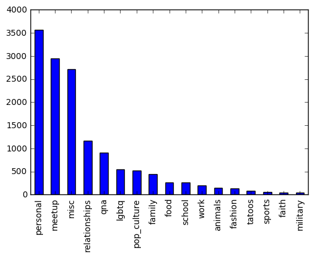
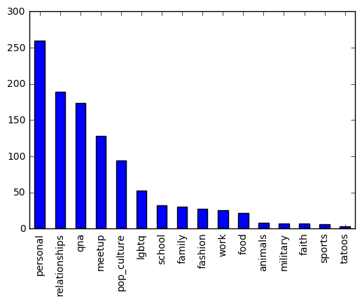

+++
showonlyimage = false
draft = false
image = "/github_analysis_files/github_avatar.png"
date = "2016-11-10"
description="An analysis for Whisper"
title = "Whisper"
weight = 0
author = "David Karapetyan"
tags = [ "data_science" ]
+++


# Introduction

We will, via a pipeline and a cross-validated gridsearch over a variety of models
and parameters, find the optimal model (with respect to the f1_macro metric)
including optimal parameters, for this dataset.
The text data will be preprocessed under the hood via arguments
passed ot the Tdidf Vectorizer (for example,
stop words will be filtered).

First, we import all the models we will be evaluating via our pipeline,
along with scikit-learn's bundled list of English stop words.


```python
from csv import DictReader
from sklearn.linear_model import LogisticRegression
from sklearn.feature_extraction.text import TfidfVectorizer
from sklearn.pipeline import make_pipeline
from sklearn.metrics import f1_score
from sklearn.ensemble import RandomForestClassifier, AdaBoostClassifier
from sklearn.svm import SVC
from sklearn.neural_network import MLPClassifier
from sklearn.neighbors import KNeighborsClassifier
from sklearn.model_selection import GridSearchCV
from sklearn.feature_extraction.stop_words import ENGLISH_STOP_WORDS
import numpy as np
import shelve
import pandas as pd
```

## Implementation

Next, we define a function to read in our text data into a list format (code
supplied by Whisper).


```python
def read_data(name):
    text, targets = [], []

    with open('data/{}.csv'.format(name)) as f:
        for item in DictReader(f):
            text.append(item['text'].decode('utf8'))
            targets.append(item['category'])

    return text, targets
```

We define our helper functions for this program, with comments supplied
within the body of the function, explaining certain choices.

First, we construct an ensemble model leveraging scikit-learn pipelines
and Stratified cross-validated
grid-search to find an optimal model for our training data set.


```python
def ensemble(text_train=read_data('train')[0],
             targets_train=read_data('train')[1],
             models=("svc", "rfc", "mlpc", "lr"),
             # other choices are knc, and abc
             scorer="f1_macro"):
    # We first define the barebones classifiers, then gridsearch
    # to hypertune their parameters
    classifiers = dict(
        knc=KNeighborsClassifier(),
        svc=SVC(),
        rfc=RandomForestClassifier(),
        mlpc=MLPClassifier(),
        abc=AdaBoostClassifier(),
        lr=LogisticRegression()
    )

    pipe_models = []

    # Because gridsearch already runs in parallel, we do not pass
    # option to run in parallel to the individual estimators, as
    # this will result in a scikit-learn error (parallel jobs will end up
    # spawning parallel jobs, and the scikit-learn scheduler won't be able to handle this.

    # Could move this to a configuration file, but I believe this is overkill
    # for a data challenge
    dict_of_params = dict(
        # kneighbors
        knc=dict(kneighborsclassifier__n_neighbors=[5, 10, 20],
                 kneighborsclassifier__weights=['uniform', 'distance']),
        # svc
        svc=dict(svc__kernel=['rbf'],
                 svc__C=np.logspace(base=10, num=6, start=0, stop=3),
                 svc__gamma=list(np.logspace(
                     base=10,
                     num=5,
                     start=-3,
                     stop=1)),
                 svc__class_weight=[None]),
        # rfc
        rfc=dict(randomforestclassifier__criterion=['gini',
                                                    # 'entropy'
                                                    ],
                 randomforestclassifier__max_features=["auto"],
                 randomforestclassifier__n_estimators=[50, 200, 400],
                 randomforestclassifier__class_weight=[None]
                 ),
        # adaboost
        abc=dict(adaboostclassifier__n_estimators=[50, 200, 400]),
        #  mlp #would try gridsearch more parameters here, but program
        # takes too long to run on my macbook
        mlpc=dict(mlpclassifier__activation=['relu', 'logistic'],
                  mlpclassifier__alpha=[0.0001,
                                        # 0.00001, 0.000001
                                        ],
                  mlpclassifier__max_iter=[400,
                                           # 200, 300
                                           ]),
        # logisticregression
        lr=dict(logisticregression__C=np.logspace(base=10, num=6,
                                                  start=0,
                                                  stop=3))
    )
    # We get rid of stop words--since we are doing classification via individual
    # word frequencies and groupings of frequencies, rather than actual semantic
    # analysis, stop words will not be the main drivers of how a sentence is
    # classified (while descriptive words like Nutella,
    # girls, boys, hiking, and so on, will).

    # We remark that the ngram_range can definitely be tweaked--however, again
    # this code takes too long to run on my macbook, and increases in ngram range
    # length will result in corresponding
    # exponential increases in processing time.

    for model in models:
        pipe = make_pipeline(
            TfidfVectorizer(stop_words=ENGLISH_STOP_WORDS, lowercase=True,
                            ngram_range=(1, 1)), classifiers[model])
        pipe_model = GridSearchCV(
            pipe,
            param_grid=dict_of_params[model],
            scoring=scorer, cv=3, n_jobs=-1).fit(text_train, targets_train)
        pipe_models.append(pipe_model)

    return pipe_models
```

Next, we define our function generating
results pertaining to the generalization error of the optimal model
amongst the pipe models, on a user supplied test set.


```python
def gen_error_results(pipe_models, text_test=read_data('test')[0],
                      targets_test=read_data('test')[1]):
    predictions = []
    scores = []

    for pipe_model in pipe_models:
        prediction = pipe_model.predict(text_test)
        scores.append(f1_score(targets_test, prediction, average='macro'))
        predictions.append(prediction)

    index_best_score = np.argmax(scores)
    best_model = pipe_models[index_best_score]
    best_prediction = predictions[index_best_score]
    best_score = scores[index_best_score]

    # Lastly, we print out our results

    print("The best estimator is: {}".format(best_model.best_estimator_))
    print("The optimal parameters are: {}".format(best_model.best_params_))
    print("The best prediction is: {}".format(best_prediction))
    print("The f1_score for this prediction is: {}".format(best_score))
    print("Comparison of f1_score for this prediction vs a grid-searched"
          " logistic regression: {} : {}".format(best_score, scores[-1]))

    return best_model, best_prediction, best_score, pipe_models, predictions, \
           scores
```

Lastly, we define our main driver. We will be using the output of this function to draw
conclusions about our analysis.


```python
def main():
    return gen_error_results(ensemble())

# Up to here, the supplied ipython notebook and this file are identical.
# We do some more analysi in the ipython notebook from this point on.
```

## Experimentation


```python
output = main()
```

    The best estimator is: Pipeline(steps=[('tfidfvectorizer', TfidfVectorizer(analyzer=u'word', binary=False, decode_error=u'strict',
            dtype=<type 'numpy.int64'>, encoding=u'utf-8', input=u'content',
            lowercase=True, max_df=1.0, max_features=None, min_df=1,
            ngram_range=(1, 1), norm=u'l2', preprocessor=None, smoo...,
      max_iter=-1, probability=False, random_state=None, shrinking=True,
      tol=0.001, verbose=False))])
    The optimal parameters are: {'svc__gamma': 0.001, 'svc__class_weight': None, 'svc__kernel': 'rbf', 'svc__C': 1000.0}
    The best prediction is: ['misc' 'misc' 'misc' ..., 'meetup' 'personal' 'personal']
    The f1_score for this prediction is: 0.531673331157
    Comparison of f1_score for this prediction vs a grid-searched logistic regression: 0.531673331157 : 0.497843531941


First, running the model, you can observe from the output that the best performing model is
the SVC (with gamma small enough that it is basically a linear SVC). It takes a considerable time to run.

Furthermore, observe that the 'f1_macro' score isn't the best. Indeed, my runs showed that
the svc performed only marginally better than the logistic regression
(0.53 f1_macro score compared with a 0.49 f1_macro score from the logistic
regression. This suggests that the data labeling may be throwing off our models.

Intuitively, the miscellaneous tag could be problematic, as it is rather vague.
We next look into excising it from the data, and seeing if that improves our predictions. 


```python
train_text, train_targets = read_data('train')
test_text, test_targets = read_data('test')
master_df_train = pd.DataFrame({'Text': train_text, 'Tags': train_targets})
master_df_test = pd.DataFrame({'Text': test_text, 'Tags': test_targets})
```

Observe that a large number of tags are indeed miscellaneous:


```python
%matplotlib inline
master_df['Tags'].value_counts().plot(kind='bar')
```


    <matplotlib.axes._subplots.AxesSubplot at 0x120b63790>





Filtering out the misc tags gives:


```python
df_train_filt = master_df_train[master_df_train['Tags'] != 'misc']
df_test_filt = master_df_test[master_df_test['Tags'] != 'misc']
```

We now run a grid-searched SVC (identified as the optimal model on the full corpus) on the filtered dataset, to see
if indeed the miscellaneous tags were the main drivers behind our relatively weak 'F1_macro' score.


```python
pipe_models = ensemble(text_train=df_train_filt['Text'],
             targets_train=df_train_filt['Tags'],
             models=("svc",),
             scorer="f1_macro")
error_results = gen_error_results(pipe_models, text_test=df_test_filt['Text'],
                      targets_test=df_test_filt['Tags'])
```

    The best estimator is: Pipeline(steps=[('tfidfvectorizer', TfidfVectorizer(analyzer=u'word', binary=False, decode_error=u'strict',
            dtype=<type 'numpy.int64'>, encoding=u'utf-8', input=u'content',
            lowercase=True, max_df=1.0, max_features=None, min_df=1,
            ngram_range=(1, 1), norm=u'l2', preprocessor=None, smoo...,
      max_iter=-1, probability=False, random_state=None, shrinking=True,
      tol=0.001, verbose=False))])
    The optimal parameters are: {'svc__gamma': 0.01, 'svc__class_weight': None, 'svc__kernel': 'rbf', 'svc__C': 251.18864315095797}
    The best prediction is: ['pop_culture' 'personal' 'meetup' ..., 'pop_culture' 'meetup' 'personal']
    The f1_score for this prediction is: 0.574781934343
    Comparison of f1_score for this prediction vs a grid-searched logistic regression: 0.574781934343 : 0.574781934343


Filtering the misc tags has resulted in a slight improvement for our model. We ask: which tags does our predictive model most have trouble with?


```python
test_vs_prediction = df_test_filt.copy()
test_vs_prediction["Prediction"]=error_results[1]
mismatches = test_vs_prediction[test_vs_prediction['Tags']!=test_vs_prediction['Prediction']]
mismatches['Tags'].value_counts().plot(kind='bar')
```


    <matplotlib.axes._subplots.AxesSubplot at 0x120fa82d0>





Given more time and greater processing power for this data challenge, I would focus on trying to predict the 'personal', 'relationships', and 'qna' tags, ignoring the others temporarily.  Furthermore, I would look into using a more advanced text vectorizer model (i.e. a larger range for the ngrams, and more generally, word embedding models preserving semantic relationships between words). Lastly, more feature engineering may be needed (for example, all the tags may be vague, or be lumping together disparate topics under one heading--for example, the tag 'relationships'). 
